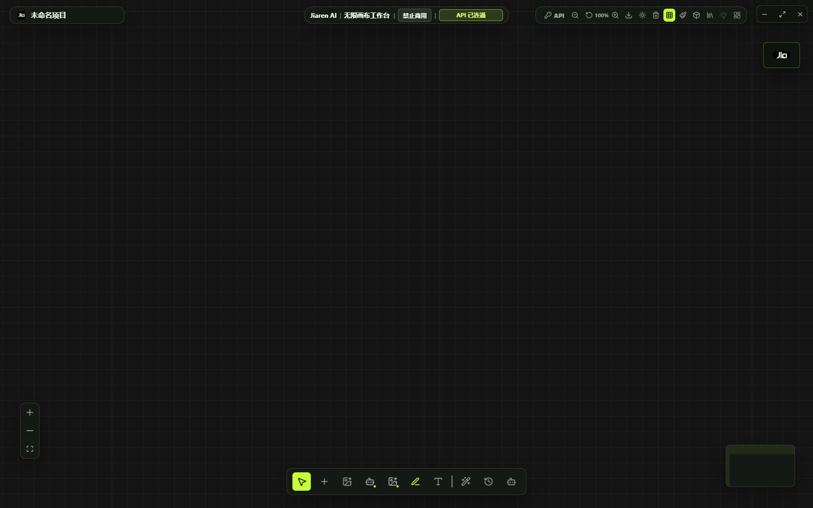
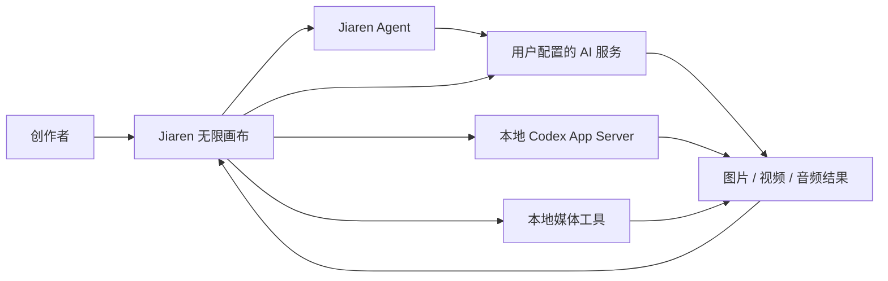
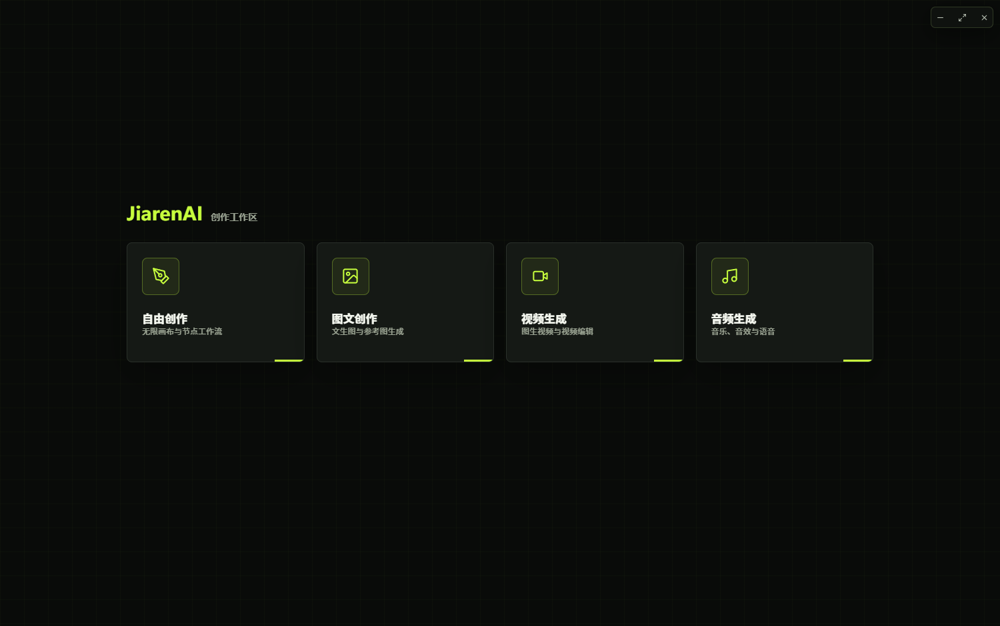
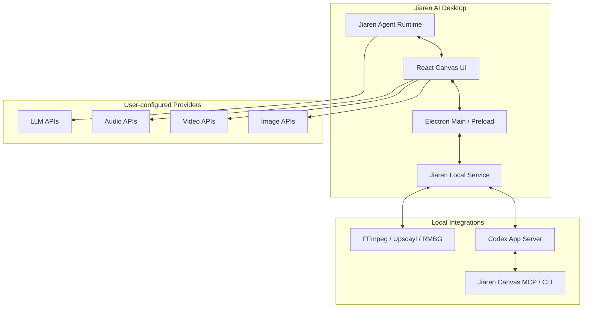

<h1 align="center">
  <br>
  
  <br>
  Jiaren AI
  <br>
</h1>

<h4 align="center">AI Agent 驱动的桌面无限画布创作工作台</h4>

<p align="center">图片 · 视频 · 音频 · 设计工作流 · 本地 Codex · 多供应商 API · 创作者社区</p>

<p align="center">
  <a href="https://github.com/jiaren0620-prog/jiaren-ai-releases/releases/latest"></a>
  <a href="LICENSE"></a>
  <a href="https://win.jiaren.xyz"></a>
</p>

<p align="center">
  
  
  
  
  
</p>

<p align="center">
  <a href="#快速开始">快速开始</a> · <a href="#核心能力">核心能力</a> · <a href="#下载与校验">下载</a> · <a href="#技术架构">架构</a> · <a href="#许可与商业授权">许可</a> · <a href="#问题反馈">反馈</a>
</p>

<p align="center"></p>

---

## 项目简介

Jiaren AI 是一款面向个人创作者、编程学习和工业设计研究的桌面 AI 无限画布工作台。它把节点画布、多模型生成、本地媒体处理、Jiaren Agent、本地 Codex 联动与创作者社区放进同一个桌面应用，让文字、图片、视频、音频和工作流可以在一个项目中持续连接、保存和复用。

本仓库是 Jiaren AI 的官方源码与发行仓库，提供：

- Windows 正式安装包与版本更新文件；
- Jiaren AI 桌面端可维护源码；
- 自动化补丁、发行回归测试与构建配置；
- 版本说明、SHA-256 校验和第三方许可声明。

Jiaren AI 不内置、不售卖、不托管任何大模型 API Key。联网生成能力由用户自行配置的模型服务提供，画布项目和 API 配置默认保存在本机。

## 核心能力

<table>
<tr>
<td width="25%" align="center"><h3>无限画布</h3>节点创建、连接、分组、选择、本地保存与最近项目恢复，支持图片、视频、音频和工具节点持续串联。</td>
<td width="25%" align="center"><h3>Jiaren Agent</h3>使用软件内配置的对话模型理解任务、规划步骤，并在用户授权范围内创建和操作画布节点。</td>
<td width="25%" align="center"><h3>本地 Codex</h3>连接用户电脑上独立安装和登录的 Codex App Server，展示流式对话、工具进度、审批和画布结果。</td>
<td width="25%" align="center"><h3>多渠道生成</h3>图片、视频和音频接口独立配置，支持官方服务、兼容接口与自定义调用方式，模型 ID 由用户维护。</td>
</tr>
<tr>
<td width="25%" align="center"><h3>图片工作流</h3>文生图、图生图、多参考图、透明底、标注修改、SVG、PSD、抠图、放大和完整图片右键工具。</td>
<td width="25%" align="center"><h3>视频工作流</h3>视频生成、Seedance 导演流程、镜头规划、宫格编辑、素材连接与本地 FFmpeg 处理。</td>
<td width="25%" align="center"><h3>设计与 3D</h3>工业草图、CMF、姿势与肖像辅助、3D 工作台和设计分析节点，统一使用 Jiaren 画布交互。</td>
<td width="25%" align="center"><h3>创作者社区</h3>作品浏览、发布、评论、个人中心与 Skills 分享入口，社区内容和桌面功能版本相互独立。</td>
</tr>
</table>

## 工作流程



画布负责保存上下文、素材和节点关系；Jiaren Agent 使用软件内配置的模型；本地 Codex 使用用户电脑上的 Codex 登录状态。两种 Agent 模式相互独立，Codex 登录不会替代图片或视频供应商配置，实际能力以本地服务和用户 API 为准。

## 界面预览

| 启动与本地项目 | 无限画布工作区 |
| --- | --- |
|  |  |

## V1.1.2 正式版

发布日期：`2026-08-04`

- 完成本地 Codex 与 Jiaren 画布联动，流式对话、工具状态和画布结果可见；
- Codex 图片能力只服从本地 App Server 的真实能力声明，不转交无关图片模型；
- 新增多渠道模型驱动与配置持久化；
- 优化多图片任务队列、参数切换和任务状态隔离；
- 新增图片标注修改节点并保留用户提示词；
- 恢复图片右键完整 25 项工具，修复 SVG 下载格式；
- 优化启动页四入口、安装器、更新进度、节点暗色样式和圆角一致性；
- 保留本地抠图、Upscayl、FFmpeg、Seedance、Skills、Jiaren Agent 和社区功能。

完整说明见 [V1.1.2 Release](https://github.com/jiaren0620-prog/jiaren-ai-releases/releases/tag/v1.1.2)。

## 快速开始

### 使用安装包

1. 从 [GitHub Releases](https://github.com/jiaren0620-prog/jiaren-ai-releases/releases/latest) 或 [Jiaren AI 官网](https://win.jiaren.xyz) 下载安装包。
2. 运行安装程序，阅读免责声明并勾选同意。
3. 启动 Jiaren AI，在 API 配置中填写你自己申请的服务地址、密钥和真实模型 ID。
4. 需要本地 Codex 联动时，先在电脑上安装并登录 Codex，再选择“本地 Codex”模式。

> 安装包当前未使用商业代码签名证书，Windows 可能显示来源提示。请只从官方仓库或官网下载，并核对 SHA-256。

### 阅读和构建源码

```bash
git clone https://github.com/jiaren0620-prog/jiaren-ai-releases.git
cd jiaren-ai-releases
```

仓库公开桌面应用源码、补丁和测试，但不提交 `node_modules`、模型权重、Electron/NSIS 缓存与线上社区私有部署配置。生成与官方安装包完全一致的产物，还需要自行准备 `electron-builder`、Electron、NSIS、本地模型和第三方二进制依赖。详细边界见 [`docs/SOURCE_PACKAGE.md`](docs/SOURCE_PACKAGE.md)。

## 下载与校验

| 文件 | 用途 |
| --- | --- |
| [Jiaren-AI-Setup-1.1.2-x64.exe](https://github.com/jiaren0620-prog/jiaren-ai-releases/releases/download/v1.1.2/Jiaren-AI-Setup-1.1.2-x64.exe) | Windows 10/11 x64 全功能安装包 |
| [Jiaren-AI-1.1.2-source.zip](https://github.com/jiaren0620-prog/jiaren-ai-releases/releases/download/v1.1.2/Jiaren-AI-1.1.2-source.zip) | V1.1.2 桌面端源码归档 |
| [SHA256SUMS.txt](https://github.com/jiaren0620-prog/jiaren-ai-releases/releases/download/v1.1.2/SHA256SUMS.txt) | 发布文件 SHA-256 清单 |

Windows x64 安装包大小为 **1,024,189,082 字节**，SHA-256：

```text
686D01E958D6EA964C1D94B83059D0AF3007A5DA7BBF7B6CA963180E3B393417
```

下载后可在 PowerShell 中执行 `Get-FileHash .\Jiaren-AI-Setup-1.1.2-x64.exe -Algorithm SHA256` 核对完整性。完整文件清单见 Release 中的 `SHA256SUMS.txt`。

## 系统要求

- Windows 10 或 Windows 11，64 位系统；
- 建议 16 GB 内存，大型画布和多任务建议 32 GB；
- 安装至少预留 4 GB 空间，本地项目和生成素材需要额外空间；
- 本地媒体处理对 CPU、内存和显存的需求取决于素材尺寸和并发任务数。

## 技术架构



## 技术栈

| 层级 | 技术 |
| --- | --- |
| 桌面端 | Electron 33, Windows NSIS |
| 画布前端 | React 18, Excalidraw, XYFlow, Fabric.js, Three.js |
| 本地服务 | Node.js, Express, WebSocket, SQL.js |
| 媒体处理 | Sharp, FFmpeg, ONNX Runtime, Upscayl |
| Agent 集成 | Jiaren Agent, Codex App Server, MCP, Skills |
| 测试 | Node.js assertions, runtime smoke tests, package contract tests |

## 仓库结构

| 路径 | 内容 |
| --- | --- |
| `dist/` | 桌面端前端、画布界面与功能模块 |
| `dist-electron/` | Electron 主进程、预加载桥和运行时 |
| `jiaren-local-service/` | 本地文件、资源与 Codex 联动服务 |
| `data/`、`.agents/` | Jiaren Agent、视频流程和 Skills |
| `tools/`、`plugins/` | 画布 CLI、MCP 和 Codex 插件 |
| `scripts/` | 构建补丁、功能校验与发行脚本 |
| `tests/` | 安装器、更新、画布、渠道和运行时回归测试 |
| `docs/` | 使用许可、第三方声明和源码说明 |
| `build/` | 安装器脚本与品牌构建资源，不包含大型模型权重 |

## API 与隐私边界

- 软件不内置、不售卖、不托管任何大模型 API Key 或付费通道；
- 用户填写的 API 配置和画布项目默认保存在本机；
- AI 请求按用户配置直接发送给对应服务商；
- Jiaren 官方服务用于账号、社区和版本信息，不应接收本地模型密钥；
- 第三方服务的数据处理、费用和可用性由其自身条款决定。

## 更新机制

Jiaren AI 启动后直接从 GitHub 仓库的 `latest.json` 读取版本号、更新说明、公开下载地址和 SHA-256，不再依赖旧的社区服务器更新接口。桌面程序下载更新时显示进度，完成后执行 SHA-256 校验。安装包由 GitHub Release CDN 提供，社区内容更新不要求重新安装桌面客户端。

## 许可与商业授权

Jiaren AI 采用 [Jiaren AI Community License 1.0](LICENSE) 与单独商业许可证双重许可。社区许可证是源码可见许可，不是 OSI 认可的开源许可证。

个人用户可按社区许可证免费使用未经修改的标准版本，并将生成内容用于个人或商业项目。组织生产、团队部署、二次开发、定制、嵌入、再分发、托管、竞品服务和官方支持均须事先取得商业许可证。

商业授权条款与咨询入口见 [`COMMERCIAL_LICENSE.md`](COMMERCIAL_LICENSE.md)。第三方组件继续适用各自的 MIT、Apache、AGPL 或其他许可证，详见 [`docs/THIRD_PARTY_NOTICES.md`](docs/THIRD_PARTY_NOTICES.md)；Jiaren 自定义许可不会限制第三方许可证已经授予的权利。

社区许可证和商业许可证均不授予 Jiaren AI、JiarenAI、JIA 名称、Logo、域名和产品视觉的商标使用权。再发布版本不得暗示获得 JiarenAI 官方认可，具体见 [`TRADEMARKS.md`](TRADEMARKS.md)。

## 贡献与安全

- 提交功能或修复前，请先阅读 [`CONTRIBUTING.md`](CONTRIBUTING.md)；
- 安全问题请使用 GitHub 私密漏洞报告，不要在公开 Issue 中提交密钥或漏洞细节；
- 已知版本变化见 [`CHANGELOG.md`](CHANGELOG.md)；
- 请勿提交 API Key、验证码、账号密码、Cookie、私人图片或服务器凭据。

## 问题反馈

请在 [GitHub Issues](https://github.com/jiaren0620-prog/jiaren-ai-releases/issues) 提交可复现问题，并包含 Jiaren AI 版本、Windows 版本、复现步骤、已脱敏报错，以及是否使用本地 Codex、自定义 API 或本地媒体工具。

## 官方链接

- 下载网站：[https://win.jiaren.xyz](https://win.jiaren.xyz)
- GitHub：[https://github.com/jiaren0620-prog/jiaren-ai-releases](https://github.com/jiaren0620-prog/jiaren-ai-releases)
- Releases：[https://github.com/jiaren0620-prog/jiaren-ai-releases/releases](https://github.com/jiaren0620-prog/jiaren-ai-releases/releases)

## 免责声明

使用者应自行确保 API 来源、网络访问、输入素材、生成内容和发布行为合法合规。严禁用于时政造谣、色情、暴力及其他违法违规内容。本软件按“现状”提供，不保证第三方模型持续可用、生成结果准确或适合特定用途。

---

<p align="center">Copyright © 2026 JiarenAI</p>
